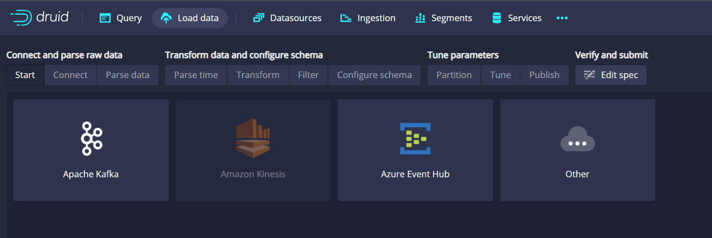

# Data Streaming -Simulation of Purchases in Ecommerce




## Project Description
This project aims to provide real-time data visualizations using the tehcnologies named below. The project ingests data from a streaming source, processes it, and generates visualizations that can be displayed in real-time.


## Technologies 

* Python 
* [Confluent Cloud](https://confluent.cloud//)
* [AWS-EC2](https://aws.amazon.com///)
* [Apache-Druid](https://druid.apache.org////)
* [Grafana](https://grafana.com////)


# Implementation
## Data ingest
* We are going to simulate purchases through a python script with a draft sample dataset of a list of tehcnology products, you can aslo use [Kaggle](https://kaggle.com//) datasets to try different simulations.

## Send messagess to Kafka Cluster with Confluent Cloud
* We need to configure a Kafka cluster to send the data simulations from our python script, we are going to create a topic wich is going to recieve the data.
    ## Steps
    * Create a Kafka cluster
    * Create a topic for your data
    * Produce a message for your topic 
    * Set up credentials (API Key, Password)
    * Produce sample 

## Install Apache Druid on an EC2 Instance 
 * Follow this steps tu run Apache Druid in your AWS EC2 Ubuntu Instance:  [ How to deploy Apache Druid on AWS EC2 Instance. ](https://medium.com/analytics-vidhya/how-to-deploy-apache-druid-on-aws-ec2-instance-50af955edef////)
 

## Connect your Confluent topic with Apache Druid

* While the messages are going to your Confluent Kafka Cloud topic you now need to connect with Apache Druid to see the data as an SQL Table and make queries in real time to see how the data behaves.


---


Count of total purchases in our app:
```SQL
SELECT count(purchase_ID) as completed
FROM your_confluent_topic
WHERE Status = 'COMPLETED'
```


## Connection between Druid and  Grafana to build visualizations
 * Now that we have running our Apache Druid, we are going to connect it with [Grafana](https://grafana.com////), we need to create a new connection and use our AWS-EC2 public ID and the port 8888 same as where Druid is listening: "https: AWS-EC2-Public-ID:8888".
 * We use the same SQL queries that we use in Druid and Grafana will recommend us differents type of visualizations to show.
 * Then we can set up alarms for differents data we want to control, Convertion_rate always above 60 % for example.


---


----


### Thank you for taking the time to read through this README! I hope you found the information helpful and informative. If you have any questions or feedback, please don't hesitate to reach out. You can contact me at [LinkedIN.](https://www.linkedin.com/in/pablo-ortin-717053190/////)
